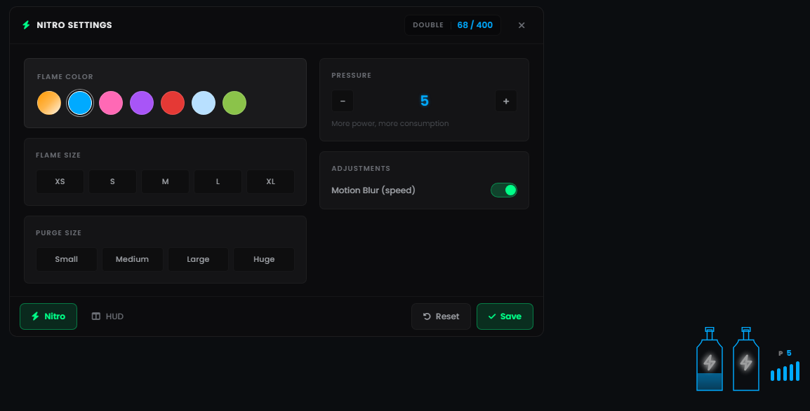
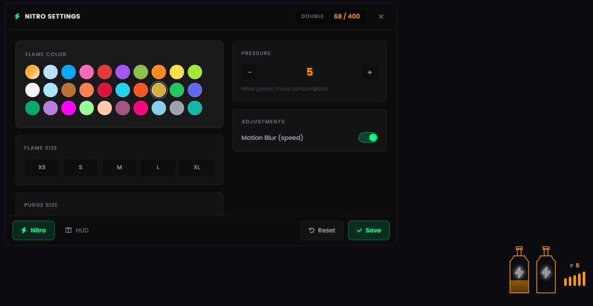
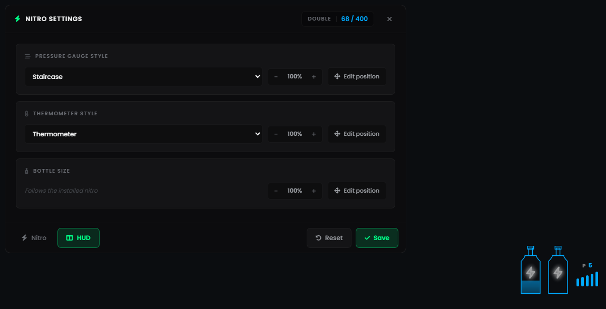

# Ryu Garage — Nitro

Nitrous system for FiveM with engine heat, purge, a physical bottle mounted inside
the car, and a fully movable HUD.

**[▶ Buy on Tebex](TEBEX_LINK_HERE)** · **[📺 Video preview](VIDEO_LINK_HERE)**

> This repository holds the **documentation only**. The resource itself is delivered
> through Tebex.

---

<p align="center">
  
</p>

## What it does

The player installs a nitrous kit on a vehicle, positions the bottle inside the car,
and from then on the tank, its heat and its settings live with that plate.

Holding the nitro warms the engine up. Past the warning line the HUD turns orange;
past the damage line the engine starts losing health, and at the top it blows and
shuts off. Purging vents the line, which **pulls heat back down** at the cost of
nitro — so the purge button is a real decision instead of a cosmetic effect.

## Features

### Nitrous

- **Single (200) and double (400) kits**, as two separate inventory items
- **5 pressure levels**, switched while driving — more power for more consumption and
  more heat
- **Refill**: using a kit on a car that already has nitro tops it up, and a double kit
  upgrades a single installation
- **Light trail** and screen effects while firing

### Engine heat

- Heat builds while the nitro is active, at a rate that scales with the pressure level
- Warning threshold with sound, damage threshold, and a blow-up point
- Cools down on its own while idle
- **Purge cooling**: venting nitrous drops the temperature much faster than idling and
  spends nitro doing it

### The bottle

- A real nitrous bottle mounted in the car — **single shows one, double shows two
  stacked**
- The player positions it with a **3D editor**: driver door camera, right mouse to
  orbit, Shift/Ctrl to raise and lower, a gizmo to move and rotate
- Movement is **clamped to the vehicle's own bounding box**, so it can never be dragged
  outside the car
- The spot is saved **per plate** and replicated, so every player nearby sees the
  bottle in the same place
- Empty tank removes the bottle; a refill brings it back

### Interface

- **Tablet-style panel** (`/nitroedit`) for flame colour and size, purge size, pressure
  and the HUD layout
- **10 pressure gauge styles** and **10 thermometer styles**
- Every HUD piece is **dragged, scaled and saved per player** — gauge, thermometer and
  bottle independently
- **30 flame colours**, 5 flame sizes, 4 purge sizes
- The colour particles ship inside the resource, so the colours work on their own with
  no other Ryu Garage script installed
- **10 languages**: EN, PT-BR, ES, FR, DE, IT, RU, ZH, JA, KO

### Under the hood

- **Per-plate persistence** with a `fake_plate` alias, so a cloned plate never loses the
  nitro installed on the original
- **Server authoritative**: every write is rate limited, ownership checked and clamped.
  A client cannot top up its own tank or wipe someone else's
- **External HUD support**: exports, statebag or a single event. Ryu-Hud and snt-hud
  work with no extra setup
- Threads idle at high wait values and only tighten up while the nitro is actually
  firing

## Screenshots

The colour grid, with 30 flame colours:

<p align="center">
  
</p>

The HUD tab, where the gauge, the thermometer and the bottle are restyled, resized and
repositioned independently:

<p align="center">
  
</p>

## Requirements

- [`ox_lib`](https://github.com/overextended/ox_lib)
- [`oxmysql`](https://github.com/overextended/oxmysql)
- **MySQL 5.7+** or **MariaDB 10.2+**
- Your framework, if any

## Frameworks

| Framework | Guide |
|---|---|
| vRP, Creative Network, Creative V5 | [INSTALL_VRP.md](INSTALL_VRP.md) |
| VRPeX | [INSTALL_VRPEX.md](INSTALL_VRPEX.md) — em português |
| QBCore | [INSTALL_QB.md](INSTALL_QB.md) |
| ESX | [INSTALL_ESX.md](INSTALL_ESX.md) |
| Standalone | Set `Config.Framework = "standalone"` — no permission checks |

## Integration

Install from your own script, with no item:

```lua
exports['rgarage_nitro']:Install('nitrosingle', vehNet, plate)   -- or 'nitroduo'
```

Read the state for your own HUD:

```lua
exports['rgarage_nitro']:HasNitro()        -- true/false
exports['rgarage_nitro']:IsNitroActive()   -- firing right now
exports['rgarage_nitro']:GetNitroLevel()   -- 0-400
exports['rgarage_nitro']:GetNitroType()    -- "single" | "double"
```

## What is open

`config.lua`, `Locales.lua`, the SQL file, every framework bridge and the whole UI ship
unencrypted and are yours to edit. Only the core logic is escrow protected.

## Support

Found a bug or need help with the install? Open an issue in this repository.
